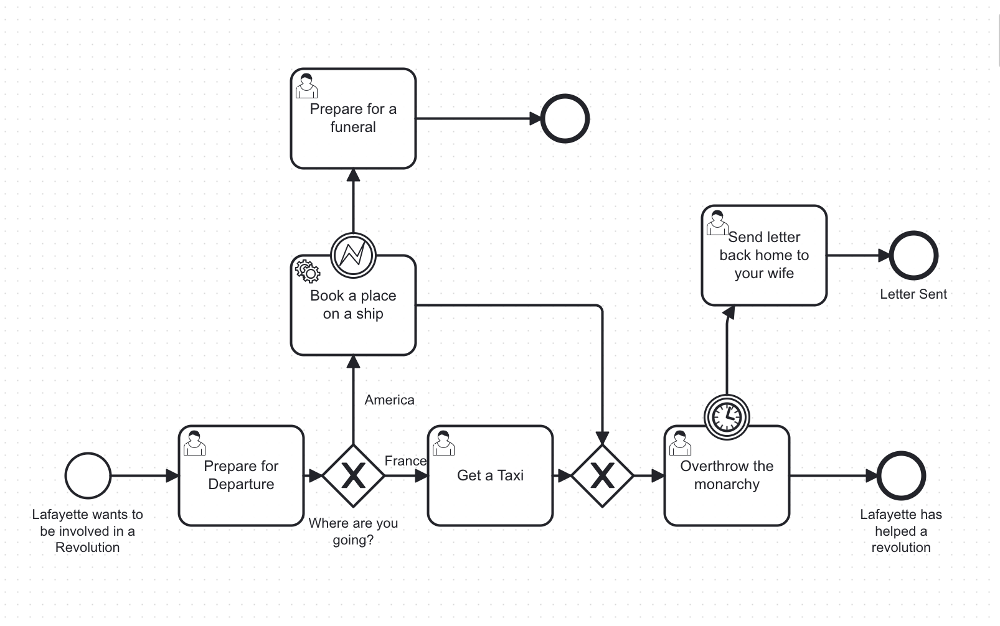

# BPM Approval Process

This is a **simple example of a business approval process** implemented with **BPM / Camunda**.  

---

## BPMN Elements Used

- ◯ **Start Event** – starts the process
- 👤 **User Task** – waits for a human action
- ⌧ **Service Task** – runs Java code
- ◇ **Exclusive Gateway** – makes a decision
- ⏱ **Timer Event** – waits for a defined time
- ❗ **Boundary Error Event** – handles errors from a task
- ◎ **End Event** – ends the process

## Technical Implementation (Camunda + Java)

